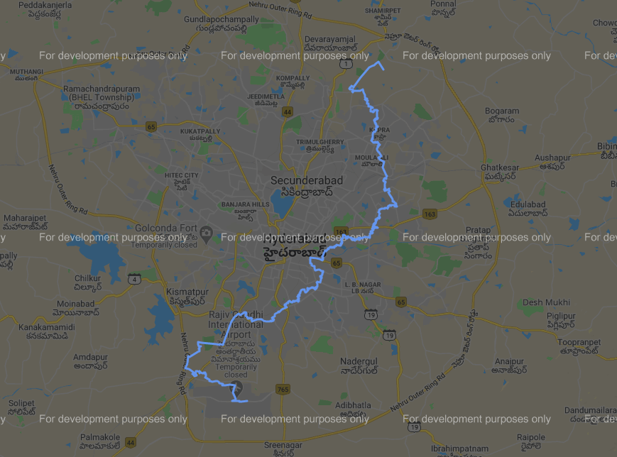

# Project Description
> An implementation of a star algorithm in python3 to find the shortest path between two given locations.

## Steps to follow:
1. First download the map data from [openstreetmap](https://www.openstreetmap.org/export). After exporting, if the file doesn't have any filename extension then change it to a ```.osm``` format.
2. Use this [tool](https://drive.google.com/open?id=1HSD87-LS5dNTD8QyI8JpoddzDwc1wTqD) to convert file format from ```.osm``` to ```.pbf```. Make sure that you use the tool in the same directory where ```map.osm``` is present.
3. Get a rust distribution with [cargo](https://www.rust-lang.org/tools/install).
4. Run ```cargo --version``` to check if the package has been installed correctly. If not, use google. Run ```cargo install osm4routing``` to install ```osm4routing``` package. The ```.csv``` files have a header row, to know more, refer the ```osm4routing``` code [here](https://github.com/Tristramg/osm4routing2).
5. Use command ```osm4routing <path_to_your.osm.pbf>``` in cmd. This will yield two ```.csv``` files namely ```nodes.csv``` and ```edges.csv``` in ```C:\Users\<Username>```

To run the code on this repo, the [nodes.csv](https://drive.google.com/open?id=1-LJF0HO7PBlcdjHxNBbifJfubxf36v4X) and [edges.csv](https://drive.google.com/open?id=1DdHNQ8hMwFY1ug6WcyyPmYCgkYuGIKWx) files can be downloaded. Pseudocode for A* star algorithm is given on [wikipedia](https://en.wikipedia.org/wiki/A*_search_algorithm).

This implementation of A* is not very efficient for reasons:
> 1. The use of pandas dataframe for graph construction. The graph can be constructed directly by parsing the edges.csv file.
> 2. The heuristic function can make sql queries instead of searching lat lons in pandas dataFrame.

There are various such other possibilities that can help make this code run more efficiently. To contribute, please create a pull request.
